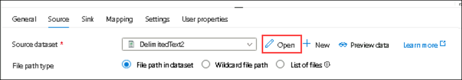

## Lab 1: Migrate data from Azure Synapse Analytics to Fabric Data Warehouse

### Estimated Duration: 120 Minutes

## Overview

This lab provides a comprehensive, hands‑on experience to help you understand and execute the end‑to‑end process of migrating data and metadata from **Azure Synapse Analytics dedicated SQL pools** to the **Microsoft Fabric Data Warehouse**. As organizations modernize their analytics platforms, Microsoft Fabric offers a unified, scalable, and fully integrated environment that simplifies data engineering,
warehousing, real‑time analytics, and business intelligence.

Throughout this lab, you will create and configure Azure Synapse components, ingest sample datasets, integrate them through pipelines, set up a new Fabric workspace, and use the **Fabric Migration Assistant** to seamlessly migrate metadata and data into the Fabric Data Warehouse. You will also learn to reroute dependent analytical tools and processes to the migrated environment, ensuring business continuity.

## Objectives

By the end of this lab, you will be able to:

- Task 1: Create a Synapse workspace in the Azure portal
- Task 2: Create a dedicated SQL pool
- Task 3: Place sample data into the primary storage account
- Task 4: Integrate with pipelines
- Task 5: Create a Fabric workspace
- Task 6: Copy metadata
- Task 7: Fix problems using Migration Assistant
- Task 8: Copy data using Migration Assistant
- Task 9: Reroute connections

## Task 1: Create a Synapse workspace in the Azure portal

1. In the Azure portal search bar, search for **Synapse Analytics (1)** and select **Azure Synapse Analytics (2).** 

        

1. In the Azure Synapse Analytics home page, click **+ Create**.

     

1. Enter below details to create resource group and then click on **OK**.

    - **Subscription**: Select the default subscription **(1)**
    - **Resource Group**: Select the **fabric-rg (1)** Resource group
    - **Workspace name**: Enter **fabric-synapse<inject key="DeploymentID" enableCopy="false"/> (3)**
    - **Region**: <inject key="Region" enableCopy="false"/> **(4)**

        

    - **Select Data Lake Storage Gen2 account:** From subscription
    - **Account name:** Create
    - **New:** **fabricsynapsegen2<inject key="DeploymentID" enableCopy="false"/> (1)**
    - Click **OK (2)**

        

    - **File System Name**: **Create (1)**
    - New: **synapsefile<inject key="DeploymentID" enableCopy="false"/> (2)**
    - Click **OK (3)**.
    - Now, click on **Next: Security > (4)**.

        

1. Configure the **Security** settings by selecting **Use both local and Microsoft Entra ID** authentication as Authentication method:

    - **SQL Server admin login:** `sqladmin` **(1)**
    - **SQL Password**: `password321!` **(2)**
    - Click **Review + create (3)**

      

1. In the **Review + submit** tab, once the validation is passed, click on the **Create** button.

    

1. This deployment may take a few minutes.

    

1. Click on **Go to resource group** button.

    

1. Click on your **fabric-synapse<inject key="DeploymentID" enableCopy="false"/>** workspace from the list.

        
     
    ### Congratulations!

     You’ve completed the task. Now let’s validate it:
     
     - Hit the **Validate** button for the corresponding task.
     - If successful, proceed to the next task.
     - If not, retry using the lab guide.
     - Need help? cloudlabs-support@spektrasystems.com
     <validation step="e3fdb79a-98cb-4e59-83c9-63793a1bb5fc" />
        
## Task 2: Create a dedicated SQL pool

1. On the **fabric-synapse<inject key="DeploymentID" enableCopy="false"/>** workspace Overview page, click **Open** in the **Open Synapse Studio** dialog to launch Azure Synapse Studio.

     

1. In Synapse Studio, select **Manage** from the left navigation pane.

     

1. Select **SQL pools (1)** under **Analytics pools** and then click on **+ New (2)** to create a new SQL pool.

     

1. On the Basics tab of **New dedicated SQL pool** page, add the following details:

    - **Dedicated SQL pool name:** **sql dedicated pool (1)**
    - **Performance level:** Choose **DW100c (2)**
    - Click **Review + create (3)**

        

1. In the **Review + submit** tab, once the Validation is Passed, click on the **Create** button.

     

     

1. Go to **Manage → SQL pools** and confirm the newly created Dedicated SQL Pool **sql dedicated pool** shows status as **Online**

     

1. Return to the **Azure portal**. In the **Overview** section of the Synapse workspace, copy the **Dedicated SQL endpoint** and **Dedicated SQL pool** details, and save them in a Notepad for later use.

     

     ### Congratulations!

     You’ve completed the task. Now let’s validate it:
     
     - Hit the **Validate** button for the corresponding task.
     - If successful, proceed to the next task.
     - If not, retry using the lab guide.
     - Need help? cloudlabs-support@spektrasystems.com
     <validation step="8004f3de-9884-4a7f-9217-913b84b70092" />

## Task 3: Place sample data into the primary storage account

1. Navigate to **Synapse Studio**, then open the **Data (1)** from the left navigation pane and select the **Linked (2)** section.
 
     

1. Under the **Linked** tab in the Data pane and expand **Azure Data Lake Storage Gen2** to locate and expand your workspace name, such as **fabric-synapse<inject key="DeploymentID" enableCopy="false"/> (Primary — asastorageaccount01 (your storage account))** to view the container.

     

1. Select the container named **synapsefile<inject key="DeploymentID" enableCopy="false"/> (Primary)**.

     

1. Select the **synapsefile (Primary)** container under **Azure Data Lake Storage Gen2**, then click **Upload** to add files into the storage container.

     

1. Click the **folder icon** next to **Select files** to browse and choose files from your local system for upload.

     

1. Browse to `C:\LabFiles\lab file` **(1)**, choose **NYCTripSmall.parquet (2)**, and click **Open (3)**.

     

1. Click **Upload** to upload the **NYCTripSmall.parquet** file uploaded successfully.

     

1. Repeat the same steps to upload the remaining **DimDate.csv, Dimension_Employee.csv** files
    
     

     

1. Right-click on **NYCTripSmall.parquet (1)** and select **Properties (2)**.

     

1. In the **Properties** page, copy the **URL and ABFSS path**, then save them in Notepad for later use.

     

## Task 4: Integrate with pipelines

1. **In Synapse Studio,** navigate to the **Integrate (1)** section, click the **+ (2)** button, and select **Pipeline (3)** to create a new data pipeline.

     

1. Under **Activities**, expand the **Move and transform (1)** category, then drag a **Copy data (2)** activity onto the canvas.

     

     

1. On the **Source** tab, select **+** **New**.

     

1. In **New integration dataset** pane, select the **Azure Data Lake Storage Gen2** tile.

     

1. Select the **DelimitedText** tile and click **Continue**.

     

1. In **Set properties** pane, click **+ New** under **Linked service** to
    create a new connection to the storage account.

     

1. In **New linked service**, provide a name, select your **Azure subscription (1)** and **Storage account (2)** from the drop-down, then click **Test connection (3)** and **Create (4)** after a successful validation.

     

1. Browse and select the **folder**, then choose the required file.

     

1. Select **synapsefile<inject key="DeploymentID" enableCopy="false"/>**, choose the **DimDate.csv (1)** file, and then click **OK (2)**.

     

     

1. Click **Open** next to **Source Dataset**

     

1. Go to the **Connection (1)** tab, configure the file settings such as delimiter and encoding, and ensure the **Escape character** is set to **Double quote (") (2)** for correct data parsing.

     

1. Click on **Pipeline 1** tab.

         

1. In the Synapse pipeline, go to the **Sink** tab within the **Copy Data** activity, select **+** **New** to configure the destination settings for the dataset.

     

1. In **New integration dataset**, select the **Azure Synapse Analytics** tile, then click **Continue**.

     

 1. In **Set properties** pane, click **+ New** under **Linked service**

1. In the **New Linked Service** setup pane, configure the connection to the Synapse SQL dedicated pool by adding the following details:

    - **Azure subscription**: Select your subscription from the drop-down **(1)** 
    - **Server name**: Select your **fabric-synapse<inject key="DeploymentID" enableCopy="false"/>** workspace from the drop-down **(2)**
    - **Database name**: Select **sql dedicated pool (3)** from the drop-down
    -  **User name**: Enter *sqladmin*  **(4)**
    - **Password**: Enter *password321!* **(5)** 
    - Click **Test connection (6)**. If the test is successful, click **Create (7)**.

       

1. In the **Set Properties** window,, enable **Enter manually (1)**, specify the schema as **dbo (2)** and the table name as **fabric (3)**, select **None (4)** for Import schema, and then click **OK (5)** to save the configuration.

     

1. Select the **Auto create table (1)** option under **Sink** tab and then click on the **Mapping (2)** tab to proceed.

     

1. Click **Import schemas** to automatically detect and load the file structure.

     

1. Click **Debug** to run the pipeline and validate the data copy activity before publishing.

     

     

1. Navigate back to the **Copy data (1)** activity, click the **Source (2)** tab, and click **Open (3)** next to **Source dataset** to view the configuration.

     

1. Click **Browse** folder to add the file.

     

1. Select the **Dimension_Employee.csv (1)** file and click **OK (2)**.

     

1. Click on **Pipeline 1** tab.

     

1. Click on the **Sink (1)** tab and then select **Open (2)** to view the sink dataset configuration.

     

1. Enable **Enter manually (1)**, specify the schema as **dbo (2)** and table name as **fabric_employee (3)**, and return to **Pipeline 1 (4)** to continue configuring the pipeline.

     

1. Go to the **Mapping (1)** tab and click **Import schemas (2)**.

     

1. Click **Debug** to test and validate the pipeline execution.

     

     

1. **In Synapse Studio,** click on the **Data**.

     

1. Under **Workspace** tab, expand the **SQL database**, open the **sql dedicated pool (SQL)**, navigate to **Tables**, and verify that the tables **dbo.fabric** and **dbo.fabric_employee** are successfully created.

     

## Task 5: Create a Fabric workspace

1. Open your browser and navigate to the following URL to open **Microsoft Fabric** portal: 

    ```
    https://app.fabric.microsoft.com/
    ```

1. Enter the following credentials to login to the Fabric portal:  

    - **Email/Username:** <inject key="AzureAdUserEmail"></inject>

    - **Password:** <inject key="AzureAdUserPassword"></inject>    

1. On the **Fabric Home** page click on **+ New Workspaces** as shown in the image below.

     

1. On the **Create a workspace** pane that appears to the right, enter the following details, and then click **Apply (4)**.

    | Field                   | Value                                                                 |
    |------------------------|-----------------------------------------------------------------------|
    | Name                   | **Fabric_Migration<inject key="DeploymentID" enableCopy="false"/> (1)**  |
    | Advanced               | Select **Fabric (2)**                                                        |
    | Default storage format | **Small semantic model storage format (3)**                                           |

     

     

1. The Workspace is now created.

1. Select **Manage access** from the workspace menu.

     

1. In the Manage access pane, select **+ Add people or groups**.

     

1. In the Add people pane, enter below **URL (1)** in the search box, then select the **Admin (3)** role from the dropdown next to **Viewer (2)** role, and click **Add (4)** to assign permissions.
 
    ```
    https://sandboxailabs1012.onmicrosoft.com/cloudlabs.ai
    ```

    OR

    ```
    https://sandboxailabs1013.onmicrosoft.com/cloudlabs.ai
    ```

        

            

      ### Congratulations!

      You’ve completed the task. Now let’s validate it:
     
      - Hit the **Validate** button for the corresponding task.
      - If successful, proceed to the next task.
      - If not, retry using the lab guide.
      - Need help? cloudlabs-support@spektrasystems.com
      <validation step="875974db-278a-4941-80d9-42f215abd3e2" />

## Task 6: Copy metadata

1. In your Fabric workspace, select the **Migrate** button on the item
    action deck.

     

1. In the **Migrate to Fabric** source menu, under **Migrate to a warehouse**, select the **Azure Synapse Analytics dedicated SQL pool** tile.

     

1. Select **Next**.

    > **Note:** You may see the **Choose your method** screen select the default option **Upload a file with the source metadata (1)**, then click **Next (2)**.

     

1. Click **Choose file**

     

1. Browse to `C:\LabFiles\lab file` **(1)**, select the **AdventureWorks.dacpac (2)** file, and click **Open (3)**.

     

1. When the upload is complete, select **Next**.

     

1. On the **Set the destination** page, select the **Fabric_Migration<inject key="DeploymentID" enableCopy="false"/> (1)** workspace from the drop-down and specify a new warehouse name as **Migration_Warehouse (2)**, then click **Next (3)** to proceed.

     

1. Review your inputs and select **Migrate**. A new warehouse item is
    created and the metadata migration begins.

     

    > **Note:** When using the Migration Assistant, the new warehouse has **case insensitive collation**, regardless of the [**default warehouse collation setting**](https://learn.microsoft.com/en-us/fabric/data-warehouse/collation).

     

1. The Migration Assistant translates the T-SQL metadata into a format supported by the Fabric data warehouse. Once the metadata migration is complete, the Migration Assistant opens automatically. You can access it at any time by selecting the **Migration** button on the **Home** tab of the warehouse ribbon.

     

1. Review the metadata migration summary in the Migration Assistant.
    You'll see the count of migrated objects and the objects that need
    to be fixed before they can be migrated.

     

1. Select **Show migrated objects** to expand the section and see a
    list of objects that have been successfully migrated to your Fabric
    warehouse.

     

    > The **State** column indicates whether an object’s metadata was modified during translation to ensure compatibility with the Fabric Warehouse. For example, certain column data types or T-SQL constructs may be automatically converted to supported equivalents. The **Details** column provides additional information about the specific adjustments made to each object.

1. Select any object to see the adjustments that were made during
    migration.

1. Open the metadata migration summary in full screen view for better
    readability. Apply filters to view specific object types.

     

     

     

1. Optionally, select the **Export (1)**, then select **Downlaod as Excel file (2)** from the menu to download a migration summary as an Excel file.

    - The downloaded Excel file is a well-structured workbook containing two worksheets: **Migrated Objects** and **Objects To Fix**. It is MIP-compliant and adheres to your organization’s sensitivity labeling policies.
    - The CSV is lightweight and tool-friendly.

       

1. Select the exported file to review the **CSV** data.

     

     ### Congratulations!

     You’ve completed the task. Now let’s validate it:
     
     - Hit the **Validate** button for the corresponding task.
     - If successful, proceed to the next task.
     - If not, retry using the lab guide.
     - Need help? cloudlabs-support@spektrasystems.com
     <validation step="8c6aea1d-fccd-484f-af63-01504c3d9ab5" />

## Task 7: Fix problems using Migration Assistant

1. Select the **Fix problems** step in the Migration Assistant to see the scripts that failed to migrate.

    

1. Review the comments at the beginning of the script to understand the adjustments that were made.

    

1. Review and fix the broken scripts using the error information and documentation.

1. Click **Run (1)** to execute the script, and if any issues are detected, select **Fix query errors (2)** in the **Suggested action** section, then click on **Accept** to keep the changes suggested by Copilot will update the script with recommended changes. Since it is AI-driven, review the suggestions carefully and make any necessary adjustments.

    

    > **Note:** If **Step 4** does not complete successfully, you may need to run it again. Since this step is AI-assisted, occasional inconsistencies can occur. Simply repeat step 4 until it executes correctly.

1. Select **Run** to validate and create the object.

    

1. The script executes successfully.

    

1. Continue to fix the rest of the scripts. You can choose to skip fixing scripts that you don't need during this step.

    

1. Once all required metadata is ready for migration, click the **Back** button in the **Fix problems** pane to return to the top-level view of the Migration Assistant. Then, mark the **2. Fix problems** step as complete in the Migration Assistant.

## Task 8: Copy data using Migration Assistant

1. Select the **Copy data** step in the Migration Assistant.

     

1. Select the **Use a copy job** button.

     

1. Assign the name **migrate_copyjob (1)** to the new job, then click **Create (2)**.

     

1. On the **Connect to data source** page, navigate to **+ New (1)** tab, then select **Azure Synapse Analytics (SQL DW) (2)** warehouse from the list.
     

1. On the **Connection settings** tab, enter the required details below and click **Next (4)**.

    | Field    | Value                                              |
    |----------|----------------------------------------------------|
    | Server   | Enter Dedicated SQL Endpoint that you pasted into the Notepad in **Task 2 → Step 7** **(1)**   |
    | Database | **sql dedicated pool (2)**                  |
    | Username | `sqladmin`  **(3)**                                        |
    | Password | `password321!`  **(3)**                                     |

     

1. On the **Choose data** page, select the table **dbo.fabric (1)** to migrate. The object metadata should already exist in the target warehouse, then click **Next (2)**.

     

1. Click **Next**.

     

1. On the **Map to destination** page, configure each table's column mappings, then click **Next**.

     

1. Review the job summary and click **Save + Run**.

     

1. Once the copy job completes, check the **Copy data** step in the Migration Assistant. Select the back button at the top to return to the top-level view of the Migration Assistant.

     

     

## Task 9: Reroute connections

In the final step, the data loading/reporting platforms that are
connected to your source need to be reconnected to your new Fabric
warehouse.

1. Identify connections on your existing source warehouse.

    - For example, in Azure Synapse Analytics dedicated SQL pools, you can find session information including the source application, connected user, connection source, and whether it's using Microsoft Entra ID or SQL authentication:

1. Navigate to your Synapse workspace.

1. In Synapse Studio, navigate to the **Develop (1)** hub, click the **+ (2)** button to add a new resource, then select **SQL script (3)**.

     

1. Ensure that the SQL script is connected to the **SQL dedicated pool** by selecting it from both the **Connect to (1)** dropdown and the **Use database (2)** dropdown, as shown in the image.

     

1. Enter the following code **(1)** into the editor and click **Run (2)** to execute it. This query is used to identify which applications, users, and IP addresses are connecting to an Azure Synapse Dedicated SQL Pool for monitoring and auditing purposes.


    ```
    SELECT DISTINCT CASE 
            WHEN len(tt) = 0
                THEN app_name
            ELSE tt
            END AS application_name
        ,login_name
        ,ip_address
    FROM (
        SELECT DISTINCT app_name
            ,substring(client_id, 0, CHARINDEX(':', ISNULL(client_id, '0.0.0.0:123'))) AS ip_address
            ,login_name
            ,isnull(substring(app_name, 0, CHARINDEX('-', ISNULL(app_name, '-'))), 'h') AS tt
        FROM sys.dm_pdw_exec_sessions
        ) AS a;
    ```

     

1. After running the SQL script, the query results are displayed in table view, showing the application name, login name, and IP address returned by the query.

     

     >**Note:** You can update the connections for data loading (ETL/ELT) platforms to point to your Fabric warehouse:
     
         - For Power BI and Fabric pipelines, use the [List Connections REST API](https://learn.microsoft.com/en-us/rest/api/fabric/core/connections/list-connections?tabs=HTTP) to find connections to your old data source, the Azure Synapse Analytics dedicated SQL pool.
     
         - Update the connections to the new Fabric data warehouse using **Manage Connections and Gateways** under the **Settings** gear.

1. Once complete, check the **Reroute connections** step in the Migration Assistant.

     

    Congratulations! You're now ready to start using the warehouse.

     

     

    > **Important**: A dedicated SQL pool consumes billable resources as long
    as it's active. Please ensure that you pause the pool even if you are
    taking a small break from the lab execution. If the pool is in active
    state for more than 40 minutes and is not being used, your account might
    get disabled

## Review

In this lab, you successfully performed a full migration journey from
**Azure Synapse Analytics dedicated SQL pools** to **Microsoft Fabric
Data Warehouse**. You began by configuring Azure and Synapse resources,
uploading datasets, and creating data pipelines. You then created a
Microsoft Fabric workspace and used the **Migration Assistant** to
translate and migrate metadata, fix compatibility issues, and copy data
into the new warehouse.

Finally, you learned how to reroute external applications such as Power
BI, pipelines, and ETL tools to the Fabric environment to ensure smooth
operational transition. Completion of this lab equips you with essential
skills needed for modernizing analytical workloads using Microsoft
Fabric.

## You have successfully completed this Lab. Kindly click Next >> to proceed further.
